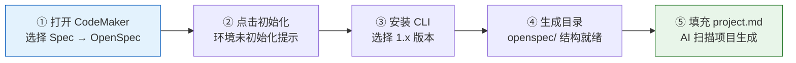
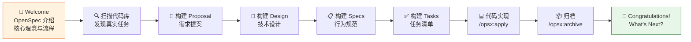
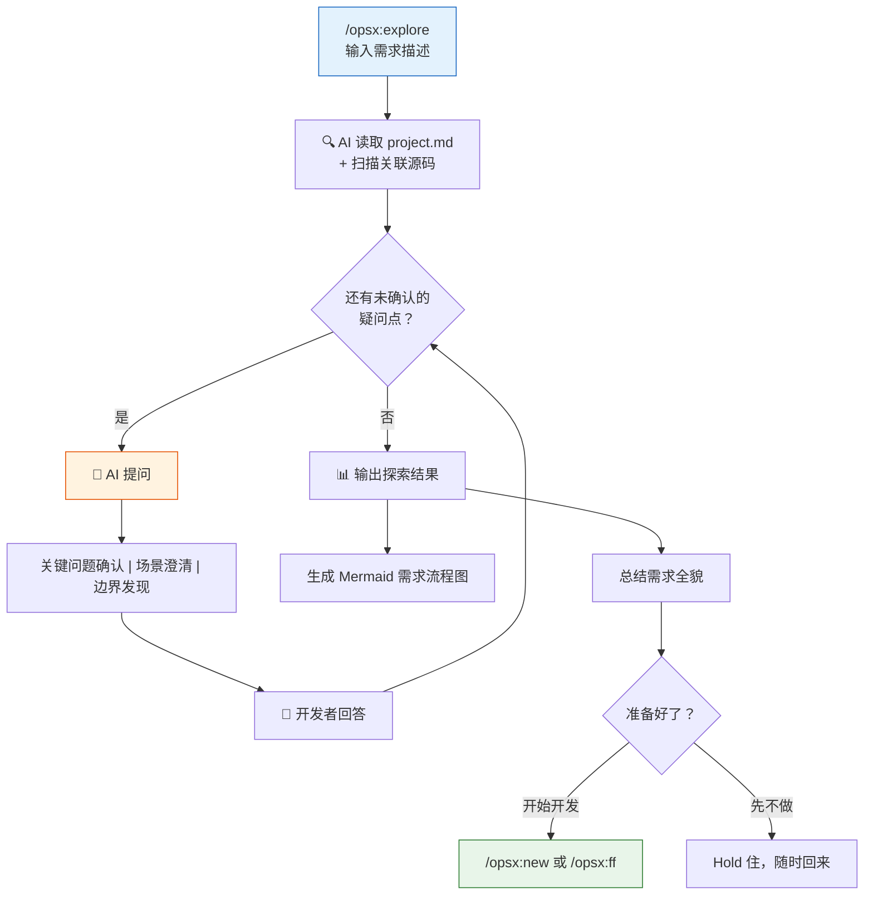
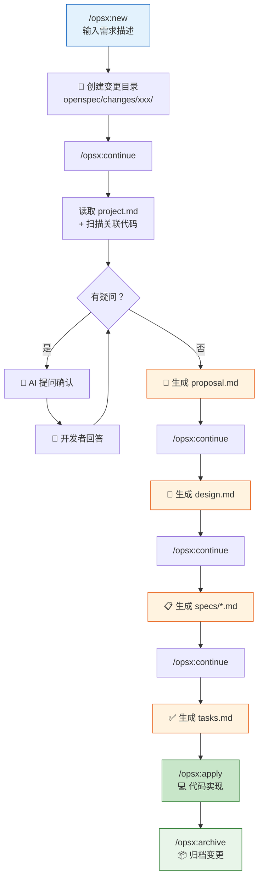
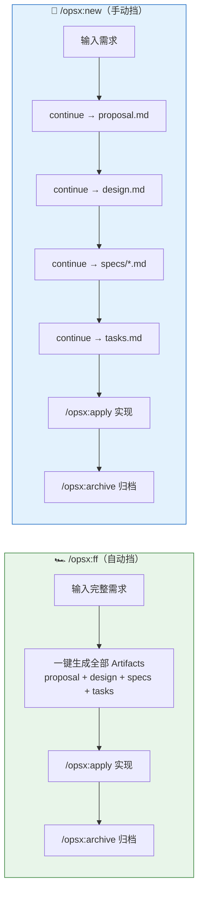

# 规范驱动开发（SDD）实战：利用OpenSpec支持NKS新增纳管私有云集群

> 发布于 2026-03-12 17:33 | 更新于 2026-03-12 17:57 | 阅读 15 分钟

在 AI 辅助编程时代，我们经常遇到这样的痛点：AI 虽然能飞快写代码，但稍微复杂点的需求它就会"跑偏"；频繁的上下文丢失让沟通成本激增。如何让 AI 准确理解复杂的业务架构和边界条件？这就引出了我们今天的主角——SDD（规范驱动开发）与 OpenSpec。

最近NKS计划新增支持私有云集群纳管，弹性扩容公有云虚机作为集群node节点，面对这个新功能，然后就利用SDD实践了一波。

> NKS全称NeteaseGame Kubernetes Service，聚焦于 K8S 容器集群的全生命周期自动化管理，包括自动化部署、回收等，基于 GCP、Aliyun、Azure 等公有云基础设施提供海外 K8S 容器集群，助力游戏出海。具体可查看[Kubernetes集群全生命周期自动化管理](https://km.netease.com/v4/detail/blog/261244)

---

## 什么是SDD

SDD全称为Specification-Driven Development，即规范驱动开发。

SDD的根本逻辑是建立一个**唯一事实来源**。团队在编写任何业务逻辑代码之前，必须先用标准化的、结构化的、无歧义的、可被机器理解的描述语言（如 Markdown、YAML、JSON）把需求的接口输入、输出、错误码、鉴权方式全部定义清楚，形成规范文档。

这个"规范"不仅仅是一份给人看的文档，它是一份具备约束力的**数字契约**。前端、后端、测试工程师的所有工作，以及自动化工具链，都围绕这份契约展开。

> 在SDD范式中，不再是文档服务于代码，而是**代码服务于规范**。

---

## OpenSpec介绍

OpenSpec是一种规范驱动开发（Spec-Driven Development, SDD）框架，其核心理念是通过结构化的文件和工作流程，让人类开发者与 AI 编程助手之间能够高效协作和对齐规范，让 AI 明确知道"知识在哪、如何用、为什么这样做"。

OpenSpec是轻量级、便携式且与IDE无关的，强调"敏捷修缮"与"增量演进"，特别适合用来存量系统中。所以在SDD编程实践中，选择了OpenSpec作为SDD的框架工具。

### OpenSpec形态

```
openspec/
├── changes/            # 类似于 Git 的分支概念，每一个新的功能或 Bug 修复都会在这里建立一个子目录
│   └── <change-name>/  # 变更的名称
│       ├── proposal.md # 变更提案：需求是什么、为什么做
│       ├── specs/      # 规范文档：记录具体要新增/修改/删除的规范
│       ├── design.md   # 设计文档：怎么改、技术方案是什么
│       └── tasks.md    # 任务清单：要实现的任务，带勾选框，做完一项勾一项
├── specs/              # 项目规范，变更归档后自动同步
└── config.yaml         # 项目配置（可选）
└── project.md          # 项目的"全局上下文"，存放项目的架构设计、开发流程、开发约束、专业术语等
```

下面再对几个关键文件做下介绍。

### proposal.md

回答 "需求是什么、为什么做"。它是变更需求的起点，用于在正式投入开发前阐述需求的核心价值、背景和目标等。

示例部分展示如下：

```markdown
# Change: 纳管私有云集群（Import Private Cloud Cluster）

## Status: 🟡 待审批

## Why
目前 `add-selfhosted-cluster-node-scaling` 功能已实现为带有 `hybrid-cloud: idc-cloud` 标签的 SkylineCluster 扩容节点的能力，但缺少**创建这类 SkylineCluster 和 Cluster 对象**的入口 API。业务方需要一个专用接口来"纳管"（Import）已有的私有云 K8s 集群，使其能够复用 NKS 的节点扩容能力。

### 核心业务场景
- **多项目共享集群**: 不同项目可以纳管同一个私有云集群（相同 GID），使用不同的 SkylineCluster 对象表示
- **多云扩容**: 每个 SkylineCluster 对象绑定一个公有云商（cloudType），只能在该云商下扩容节点
- **VPC 资源管理**: SkylineCluster 存储项目所拥有的 subnet 信息，由另外的组件负责创建云商 VPC 及关联资源

## Impact

### 受影响的规范
- `specs/cluster-management`: 新增私有云集群纳管能力
...
```

### changes/xxx/specs/.../spec.md

规范文档，记录本次变更要遵循的一些规范、约束等。

示例部分展示如下：

```markdown
## ADDED Requirements

#### Scenario: 权限不足时拒绝请求
- **GIVEN** 用户不具有集群管理权限
- **WHEN** 用户调用 `POST /cluster/import` API
- **THEN** 系统 SHALL 返回 403 错误

### Requirement: Multi-Project Cluster Sharing
系统 SHALL 支持不同项目纳管同一个私有云集群（相同 GID），使用独立的 SkylineCluster 对象表示。
...
```

### design.md

属于本次变更的设计文档，要怎么改代码，技术方案实现是什么。

示例部分展示如下：

```markdown
## Context
业务方需要将自建机房的 K8s 集群纳入 NKS 管理，以便复用公有云虚机创建能力进行节点扩容。

## Decisions

### Decision 1: 新增独立 API
**选择**: 新增 `POST /cluster/import` 接口

**原因**:
- `CreateCluster` 的校验逻辑（VPC、子网实际创建）与私有云场景不兼容
- 独立接口语义清晰，参数结构不同

### Decision 2: ImportClusterRequest Model 设计
**选择**: 定义独立的 `ImportClusterRequest` model

**结构设计**:
...
```

### tasks.md

任务拆解与进度计划，作用是记录"我们应该按照什么步骤来把东西做出来"。这是一个执行清单，将宏观的设计转化为可操作的细粒度子任务。

使用了任务复选框(Checklists)来追踪AI实际的开发进度（`[ ]` 未完成, `[x]` 已完成）。

示例部分展示如下：

```markdown
## 1. Swagger API 定义

- [x] 1.1 在 `api/swagger.yaml` 中定义 `ImportClusterRequest` model
  - [x] `importCluster` 对象 (gid, cluster, region, az)
  - [x] `cloudType` 字段
  - [x] `costinfo` 对象 (project, userProject, costProject)
  - [x] `infra` 对象 (region, az, vpc.cidrBlock, vpc.natEipCount)
  - [x] `kubernetes` 对象 (clusterNetwork.nodes.cidrBlocks, version)
  - [x] `runtime` 对象
- [ ] 1.2 在 `api/swagger.yaml` 中添加 `POST /cluster/import` 接口定义
  - [ ] 请求体使用 `ImportClusterRequest`
  - [ ] 响应使用 `ClusterSummary`
  - [ ] 添加 400/403/500 错误响应
- [ ] 1.3 运行 `./hack/generate.sh` 生成 API 代码
...
```

### project.md

整个项目的"全局上下文"。用于存放项目的目标、背景、核心业务术语、技术栈说明、全局架构、代码风格约定、核心业务逻辑说明等，以及详细的文档索引等信息。AI 可以通过读取这个文件快速了解项目的全局情况和通用约定。

```markdown
## Purpose
NKS-Cluster（Netease Kubernetes Service - Cluster）是网易游戏云平台的 Kubernetes 集群管理服务。该服务负责管理多云环境（AWS、GCP、阿里云等）下的 Kubernetes 集群全生命周期操作，包括：
- 集群的创建、更新、删除
- 节点的添加、删除、开关机操作
- Cluster Autoscaler (CA) 配置管理
- 集群 PKI 证书和 Kubeconfig 管理

## Architecture Overview

### 组件职责分离

NKS-Cluster 采用 Cluster API 架构，将集群管理分为两个独立的组件：
...

## Project Conventions

### Code Style
- **缩进**: Tab（Go 标准）
- **命名**: 
  - 包名小写，不使用下划线
  - 文件名 camelCase
  - Handler 变量以 `Handler` 后缀
  - 接口以 `Interface` 后缀
- **日志**: 使用 `k8s.io/klog/v2`，禁止使用 `fmt.Println` 或标准 `log`
- **错误处理**: 使用 `fmt.Errorf` 包装错误，包含上下文信息
...

## Important Constraints

### 安全约束
- 所有 API 必须经过权限校验 (`helpers.Authorize`)
- 敏感信息（Token、Key）通过配置文件注入
- HTTP Header 认证: `X-Auth-User`, `X-Auth-Project`, `X-Auth-Roles`

### 兼容性约束
- 不手动修改 Swagger 生成的代码 (`api/server/restapi/operations/`)
...
```

---

## OpenSpec实战

针对nks集群的纳管私有云集群支持弹性扩容公有云虚机node的新增功能，使用OpenSpec进行了一些实战。

### 环境及项目初始化

使用了codemaker来实战。

**（1）打开codemaker插件，选择Spec-Openspec；**

> 📌 操作：在 CodeMaker 插件中选择 `Spec` → `OpenSpec` 模式。

**（2）输入框提示环境未初始化，点击即可开始初始化；**

> 📌 操作：首次进入时会提示"环境未初始化"，点击提示按钮即可自动初始化。

**（3）OpenSpec-cli安装，这里安装1.x版本；**

> 📌 操作：在弹出的版本选择中，选择安装 `1.x` 版本的 OpenSpec-cli。

**（4）OpenSpec初始化，这里为项目生成OpenSpec目录；**

> 📌 操作：初始化完成后，项目根目录下会自动生成 `openspec/` 目录结构。

初始化完整流程如下：



**（5）project.md文件创建及填充；**

将以下提示词喂给codemaker，它扫描你的项目结构、依赖文件、核心代码逻辑等等，然后生成project.md，能够为OpenSpec 后续的自动化开发打下很好的基础，再也不怕OpenSpec不懂你的项目了。

```
请扫描并分析当前项目的整个代码库，帮我在 openspec/ 目录下生成并填充 `project.md` 文件。
该文件将作为 OpenSpec 规范驱动开发的全局上下文（宪法），必须专业、严谨且结构清晰。

请在这个文件中详细记录以下 5 个模块的内容：
1. **Project Overview（项目概述）**：一句话概括项目目标和核心业务背景。
2. **Tech Stack（技术栈）**：提取项目中使用的主要框架、语言版本、构建工具和核心依赖库（请写明具体版本号，如 React 18）。
3. **Architecture & Patterns（架构与设计模式）**：分析项目主要采用的目录结构和架构模式（如 MVC、微前端、前后端分离等）。
4. **Conventions & Rules（代码规范与约定）**：总结项目中的代码风格习惯。这是最重要的一环！请务必从代码中提炼：变量命名偏好、是否强制使用 const/let 禁用 var、异步处理方式（Top-level await/Promise）、错误处理机制等具体团队习惯。
5. **Core Capabilities（现有核心功能）**：简要列出目前系统已经具备的主要功能模块。

如果该文件已存在，请直接覆盖；如果不存在，请帮我创建它。输出格式请严格使用 Markdown。
```

### /opsx:onboard（新手引导模式）

核心作用：帮助开发者实现从"日常编码"向"规范优先（specification-first）"的标准化开发流程的平滑过渡，适用于首次上手使用 OpenSpec仓库内命令和工件流的开发者。

该命令会手把手带领开发者走过OpenSpec代码更改的整个完整生命周期，从想法到实现，自动扫描仓库代码，去发现一个可以优化或实现的真实任务，带领你一步一步的构建proposal、specs、design、tasks，以及代码实现，到最后的archive归档。

`/opsx:onboard`本质上就像是一个包含了`/opsx:new`、`/opsx:continue`等底层工作流命令调用的交互式向导。

这里不再展示完整的/opsx:onboard引导过程，大家可以自己上手试一下。

> 📌 引导流程概览：



> 引导完成后会显示祝贺信息，表示你已走完一个完整的变更生命周期，并提示下一步可以尝试 `/opsx:new`、`/opsx:explore` 等命令。

### /opsx:explore（探索模式）

在该模式下，AI会作为一个"思考伙伴"与你协作，它能够感知并深入分析当前的底层代码库，帮助定位潜在的问题点。

而且这是一个无负担探索，你可以自由地深挖各种潜在的问题或想法，而无需立即启动实际的代码实现流程，也不会生成任何的spec文档，没有提交废弃代码或弄乱项目结构的压力。

探索模式的完整交互流程如下：



**（1）通过/opsx:explore启动探索模式；**

```
/opsx:explore
我有一个新需求，根据纳管的私有云集群SkylineCluster对象，去寻找还没有subnetID的subnet信息，去对应云商创建subnet
```

**（2）读取项目代码，理解需求；**

AI会自动读取project.md文件，以及深入读取需求关联的代码文件。

**（3）AI与你讨论和确认所有的疑问点；**

包括潜在风险、问题点、代码细节等等，AI都会询问你，与你讨论，直到所有细节都补充完整。交互过程包括：
- **关键问题确认** — AI 会列出它不确定的关键技术点和业务边界，逐一向你确认
- **场景澄清** — 对于模糊的业务场景，AI 会提出具体问题帮助你厘清
- **进一步思考** — AI 可能发现你没有考虑到的边界情况，主动提出讨论

**（4）需求流程图编制及完整需求描述输出；**

探索结束后，AI 会生成 Mermaid 格式的需求流程图，并总结需求全貌，提示你可以进入正式开发流程。

**（5）开始SDD；**

探索完成后，就可以使用`/opsx:new`或`/opsx:ff`开始正式的SDD流程。当然也可以hold住，什么都先不做。

闲得无聊的时候可以用探索模式跟AI讨论一下目前仓库代码的问题、未来的发展方向等等都可以。

### /opsx:new（创建新变更 —— "手动挡"）

`/opsx:new`是OpenSpec核心工作流的正式起点，它代表着严格遵循"规范优先（Specification-first）"原则的开发路径。

执行`/opsx:new`后，开发者需要配合`/opsx:continue`命令，一步一个脚印地建立各种Spec文档。

`/opsx:new` + `/opsx:continue` 的完整工作流程如下：



> 💡 在上述任何步骤中，都可以打断 AI，通过对话让 AI 对当前或前面生成的文件进行修改，然后再往下继续。

**（1）通过/opsx:new创建新变更；**

```
/opsx:new
我有一个新需求，根据纳管的私有云集群SkylineCluster对象，去寻找还没有subnetID的subnet信息，去对应云商创建subnet
```

**（2）创建一个OpenSpec变更，创建对应的`openspec/changes/auto-create-vpc-subnet/`本次变更目录；**

> 📌 结果：在 `openspec/changes/` 下生成 `auto-create-vpc-subnet/` 子目录，作为本次变更的工作空间。

**（3）执行/opsx:continue，开始生成提案（Proposal）；**

期间OpenSpec会自动读取project.md文件，以及深入读取需求关联的代码文件；

> 📌 AI 行为：自动读取 `openspec/project.md` 并扫描相关代码文件，构建上下文。

如果有一些细节未确认，AI会在对话框中对你做出提问，直到完整理解需求，最后输出proposal.md文件。

> 📌 结果：生成 `openspec/changes/auto-create-vpc-subnet/proposal.md`，包含需求背景、核心场景、影响范围等。

**（4）继续执行/opsx:continue，开始生成设计文档，即输出design.md文件；**

> 📌 结果：生成 `design.md`，包含技术决策、架构方案、数据流等设计细节。

**（5）继续执行/opsx:continue，开始生成规范文档，即输出spec.md文件；**

> 📌 结果：生成 `specs/` 目录下的规范文档，包含 GIVEN-WHEN-THEN 格式的约束条件和行为规范。

**（6）继续执行/opsx:continue，开始生成任务文档，即输出tasks.md文件，至此全部Spec文件生成完毕；**

> 📌 结果：生成 `tasks.md`，包含带勾选框的细粒度任务列表。至此四个核心文件（proposal → design → specs → tasks）全部就绪。

**（7）运行/opsx:apply开始代码实现；**

**（8）运行/opsx:archive归档此变更。**

### /opsx:ff（创建新变更 —— "自动挡"）

`/opsx:ff`中的ff代表"Fast-Forward"（快进）。它是OpenSpec为了避免过度工程化而提供的一种快捷方式。

核心工作流是：接收一个已经写好的很完整完善的需求规范（Spec），然后基于这个特定的Spec，自动生成必要的产物、上下文环境、需求清单和具体的任务列表，不用一步步经历"提案->规范->设计"这样的繁琐步骤。

> **注意**：这里AI不会读取project.md文件，而是只会读取与本次需求强相关的部分具体代码。因为当你执行这个命令时，意味着你已经有了一份完整而具体的需求Spec文档。这份需求在编写时，通常已经融合了project.md中的架构意图和技术栈约束。因此，该命令只需信任并解析当前的Spec即可，无需再回头去解析一遍宏观的project.md。

`/opsx:ff` 与 `/opsx:new` 的对比如下：



**（1）通过/opsx:ff启动；**

```
/opsx:ff
我有一个新需求，根据纳管的私有云集群SkylineCluster对象，去寻找还没有subnetID的subnet信息，去对应云商创建subnet
```

**（2）proposal、specs、design、tasks文件一下子全部生成；**

> 📌 结果：AI 一次性生成全部四个核心文件（`proposal.md`、`design.md`、`specs/*.md`、`tasks.md`），无需逐步 `/opsx:continue`。变更目录下所有 Artifact 创建完毕，可直接进入实现阶段。

**（3）运行/opsx:apply开始代码实现。**

**（4）最后运行/opsx:archive归档此变更。**

> 实践下来，除非需求非常清晰，什么边界条件都定义清楚了，否则还是用"手动挡"。

---

## 经验

经过对OpenSpec在几个项目的落地实践，总结出一些经验。

### OpenSpec命令的使用推荐

1. 首次安装使用的同学，可以使用`/opsx:onboard`命令快速上手。
2. 不太清晰需求的场景，使用`/opsx:explore`打开探索模式，与AI共同探讨需求。
3. 标准而清晰的需求，通过`/opsx:new`创建新变更提案。

### project.md很重要，让AI完善它

一定要完善好project.md文件，因为无论是通过`/opsx:explore`启动探索模式，还是通过`/opsx:new`创建新变更，OpenSpec都会自动去读project.md文件来了解项目信息。

project.md文件可以自己完善，当然更快捷的办法是让AI来构建，然后人工审核优化就好了。

可以将以下提示词喂给AI，让它扫描你的项目结构、依赖文件、核心代码逻辑等等，然后自动生成project.md。

```
请扫描并分析当前项目的整个代码库，帮我在 openspec/ 目录下生成并填充 `project.md` 文件。
该文件将作为 OpenSpec 规范驱动开发的全局上下文（宪法），必须专业、严谨且结构清晰。

请在这个文件中详细记录以下 5 个模块的内容：
1. **Project Overview（项目概述）**：一句话概括项目目标和核心业务背景。
2. **Tech Stack（技术栈）**：提取项目中使用的主要框架、语言版本、构建工具和核心依赖库（请写明具体版本号，如 React 18）。
3. **Architecture & Patterns（架构与设计模式）**：分析项目主要采用的目录结构和架构模式（如 MVC、微前端、前后端分离等）。
4. **Conventions & Rules（代码规范与约定）**：总结项目中的代码风格习惯。这是最重要的一环！请务必从代码中提炼：变量命名偏好、是否强制使用 const/let 禁用 var、异步处理方式（Top-level await/Promise）、错误处理机制等具体团队习惯。
5. **Core Capabilities（现有核心功能）**：简要列出目前系统已经具备的主要功能模块。

如果该文件已存在，请直接覆盖；如果不存在，请帮我创建它。输出格式请严格使用 Markdown。
```

### 不要手工改OpenSpec生成的md文件

整个SDD的过程，往往做不到一次过，一次性生成正确的完整的代码，期间可能有很多次纠错重入的情况，比如说重新修改proposal，我们可以重新跟AI对话，指出修正意见，然后让OpenSpec重新生成修正proposal、Design、Spec和Tasks。

这里注意**千万不要手工去改OpenSpec自动生成的md文件**，因为下一次又会被OpenSpec改回去覆盖掉，正确的做法是让OpenSpec自己改。

> Proposal、Design、Spec和Tasks之间是连体的，改一个地方往往牵一发而动全身。

### Spec纳入版本控制

一定要把生成的OpenSpec生成的文件提交到Git管理。这不仅是为了追溯需求变更，更是核心的项目资产。

### Spec和Coding分开会话

当功能需求比较复杂时，OpenSpec生成Proposal、Design、Spec和Tasks文件的整个过程，上下文可能已经爆炸，而且可能已经多次压缩会话上下文，这个时候，执行`/opsx:apply`让OpenSpec开始代码实现之前，可以开一个新的会话窗口，来专门生成代码，这样AI才不会产生幻觉，生成出高质量的代码来。

> 因为Proposal、Design、Spec和Tasks文件是完善的完整的，所以新开会话再实现代码，也没有任何影响。

---

## 思考

### 局限性

SDD适用于中等到复杂的新功能开发，特别项目架构分层比较多，修改涉及跨文件、跨模块的场景；但是不太适用于简单的Bug修复，因为整个SDD流程还是太复杂，开销大于收益，直接AI Chat比使用SDD更快。

而且可能因为我的需求描述不够清晰以及确认好所有边界条件，所以SDD可能暂时也没有减少总体开发成本，成本从循环不断地修改代码转换为了循环不断地跟AI澄清需求及边界条件，不断审核代码也变成了既要审核OpenSpec生成的Spec文件，又要审核代码。后续想办法整出OpenSpec更容易理解的标准化的需求文档格式，减少跟AI澄清需求的次数，提高SDD的效率。

总体来看还是有所收益，基础代码能快速标准化生成，也能考虑到很多我们没考虑到的边界条件，并且帮助我们做了项目资产的沉淀，留下来的这些永远"活着的"且准确的文档，为以后的需求追溯、新功能开发、新成员融入等都提高了很大的便利性。

### 团队落地

关于团队落地SDD，因为大部分都是存量项目，可以使用OpenSpec，够轻量，更容易上手开始。

然后统一一些团队OpenSpec使用标准，比如：
1. 统一版本，1.x；
2. 每个repo都要有完善的用AI生成的project.md；
3. 每个变更都要有代码编译构建过程；
4. 每个变更都要有单元测试和集成测试；

编写需求转换Skills，将我们的需求，通过Skills，转换为更利于OpenSpec读懂的有标准格式的提案文档。

---

## Call to Action

**SDD先用起来，用的过程中发现问题，解决问题，用起来才能发现优势。**
