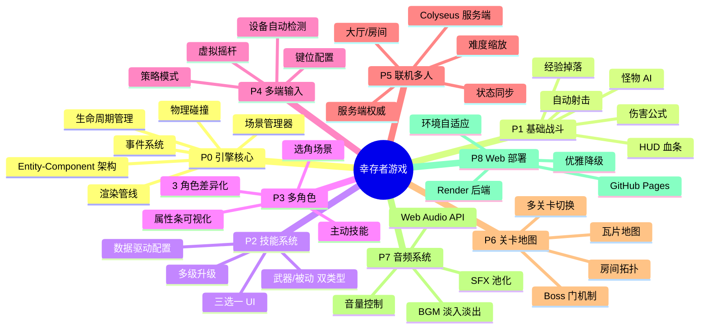
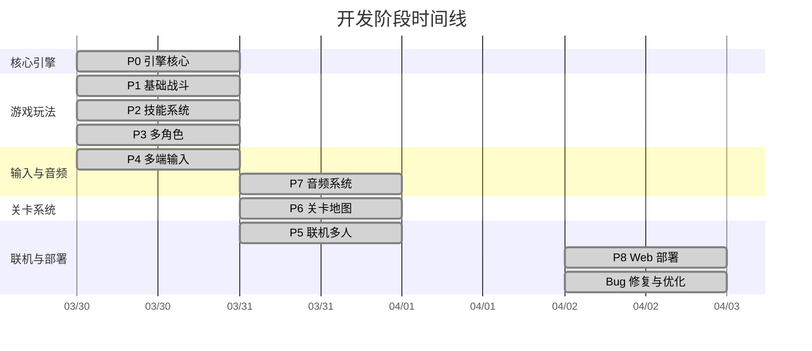
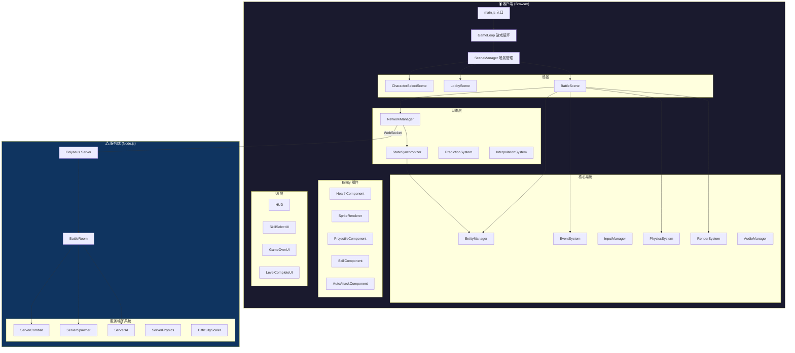

# 🎮 项目总览 — 俯视角自动射击生存游戏

> 从零到可联网可部署的完整游戏，用 JS + Canvas 2D 原型实现，为 Unity 转化做准备。

---

## 🧠 全局思维导图

---

## 📅 开发时间线

---

## 🏗️ 系统架构总图

---

## 📂 文件夹索引

| 文件夹 | 内容 | 核心设计技巧 |
|--------|------|-------------|
| [P0-引擎核心](./P0-引擎核心/) | ECS 架构、生命周期、场景管理 | 组件化 + Unity 映射 |
| [P1-基础战斗](./P1-基础战斗/) | 自动射击、怪物、伤害、经验 | 数据驱动 + 工厂模式 |
| [P2-技能系统](./P2-技能系统/) | 武器/被动、升级、三选一 | 策略模式 + 配置继承 |
| [P3-多角色](./P3-多角色/) | 角色差异化、主动技能 | ScriptableObject 模式 |
| [P4-多端输入](./P4-多端输入/) | 策略模式输入、虚拟摇杆 | Provider 抽象 |
| [P5-联机多人](./P5-联机多人/) | Colyseus、状态同步、大厅 | 服务端权威 + 预测/插值 |
| [P6-关卡地图](./P6-关卡地图/) | 房间拓扑、Boss 门、瓦片 | 延迟生成 + 物理隔离 |
| [P7-音频系统](./P7-音频系统/) | Web Audio API、BGM、SFX | 单例 + 节点图 |
| [P8-Web部署](./P8-Web部署/) | GitHub Pages、Render | 环境自适应 + 降级 |
| [PX-经验教训](./PX-经验教训/) | 踩坑记录、修复方案 | 调试方法论 |

---

## 🔑 核心设计原则（贯穿所有阶段）

| # | 原则 | 说明 | Unity 对应 |
|---|------|------|-----------|
| 1 | **组件化架构** | 功能拆分为独立 Component，挂载到 Entity | `MonoBehaviour` + `GameObject` |
| 2 | **数据驱动** | 所有数值在 JSON 中配置，代码不硬编码 | `ScriptableObject` |
| 3 | **事件解耦** | 系统间通过 EventSystem 通信，避免直接引用 | `UnityEvent` / `EventBus` |
| 4 | **工厂模式** | 实体创建通过 Factory，统一组件组装 | `Prefab` + `Instantiate` |
| 5 | **场景隔离** | 每个场景独立管理生命周期和资源 | `SceneManager.LoadScene` |
| 6 | **服务端权威** | 联网时所有游戏逻辑在服务端执行 | `Mirror` / `Netcode` |
| 7 | **优雅降级** | 后端不可用时保证单人可玩 | 离线模式检测 |
