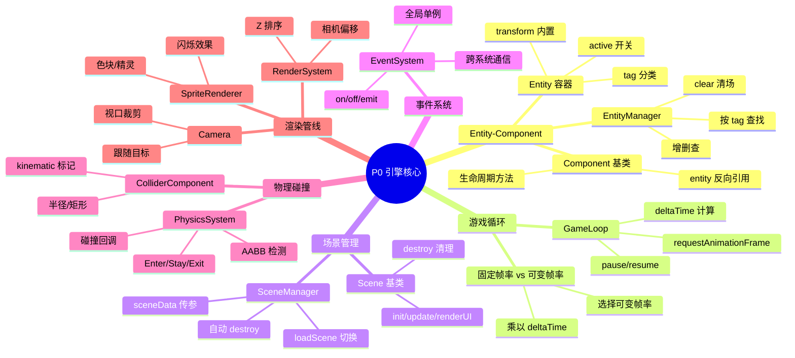
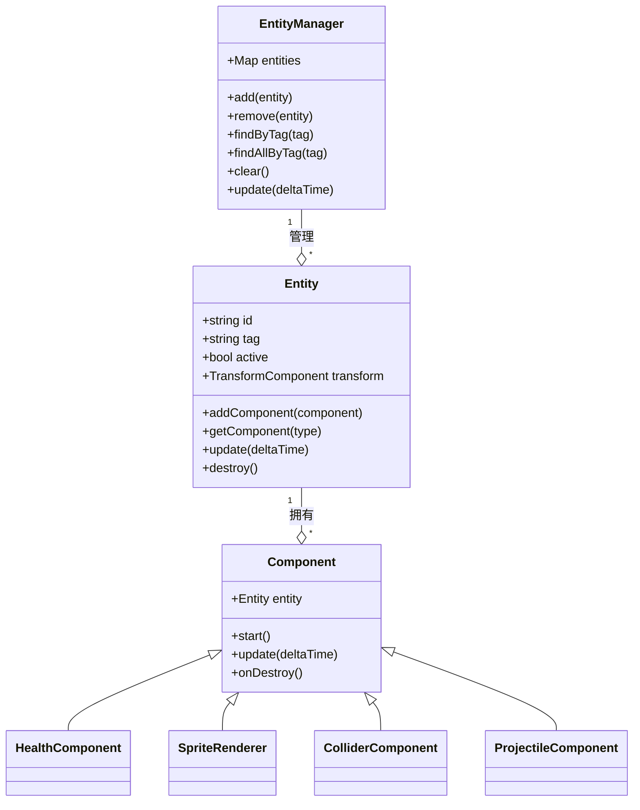
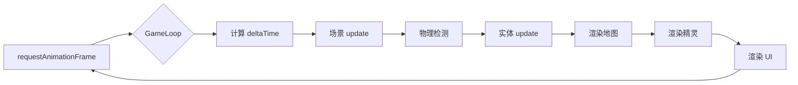
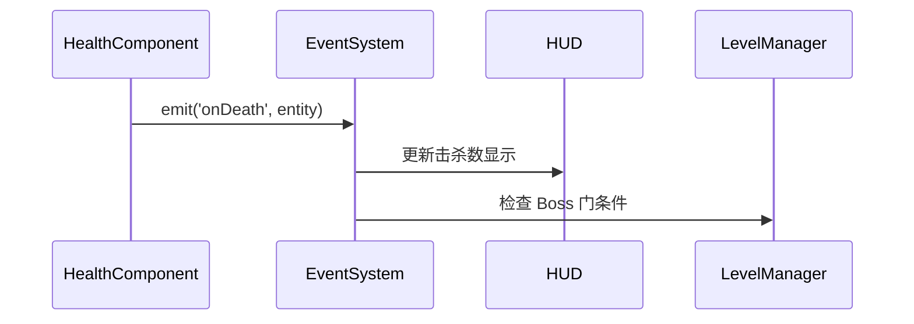
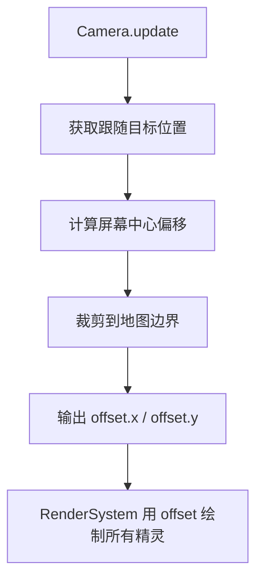

# P0 — 引擎核心设计

> 从零搭建一个模拟 Unity 架构的 2D 游戏引擎，为后续所有功能奠定基础。

---

## 🧠 设计思维导图



---

## 🏛️ 核心架构：Entity-Component System

### 设计决策

**为什么用 ECS 而不是传统 OOP 继承？**

```
❌ 继承方式（不利于 Unity 迁移）：
  Monster → FlyingMonster → BossFlyingMonster
  
✅ 组合方式（1:1 对应 Unity）：
  Entity + HealthComponent + ChaseAI + SpriteRenderer
  Entity + HealthComponent + FlyAI + SpriteRenderer + BossComponent
```

### 类关系图



### Unity 映射

```
JS                          Unity C#
─────────────────────────────────────────
new Entity()            →   new GameObject()
entity.addComponent()   →   gameObject.AddComponent<T>()
entity.getComponent()   →   gameObject.GetComponent<T>()
entityManager.add()     →   Instantiate()
entityManager.remove()  →   Destroy()
entityManager.clear()   →   SceneManager.LoadScene() 时自动清理
```

---

## 🔄 游戏循环



### 关键技巧：deltaTime

```javascript
// ✅ 正确：帧率无关的移动
position.x += speed * deltaTime;

// ❌ 错误：帧率依赖
position.x += speed; // 60fps 移动快，30fps 移动慢
```

---

## 📡 事件系统

### 设计模式：观察者模式（发布-订阅）



### 为什么不用直接引用？

```javascript
// ❌ 耦合方式：HealthComponent 需要知道 HUD 和 LevelManager
this.hud.updateKills();
this.levelManager.checkBossGate();

// ✅ 解耦方式：只发事件，谁关心谁监听
eventSystem.emit('onDeath', entity);
```

**Unity 对应**：`UnityEvent` + `EventBus` 模式

---

## 🎥 相机系统



### 核心公式

```javascript
// 相机偏移 = 目标位置 - 屏幕中心
offset.x = target.x - canvas.width / 2;
offset.y = target.y - canvas.height / 2;

// 绘制时：世界坐标 - 相机偏移 = 屏幕坐标
screenX = entity.x - camera.offset.x;
screenY = entity.y - camera.offset.y;
```

**Unity 对应**：`Camera.main` + `Cinemachine` 跟随

---

## ⚡ 设计技巧总结

| 技巧 | 应用场景 | 好处 |
|------|---------|------|
| **组件组合** | Entity 功能扩展 | 灵活、可复用、Unity 友好 |
| **生命周期** | start/update/onDestroy | 统一管理，防止内存泄漏 |
| **工厂模式** | PlayerFactory, MonsterFactory | 统一创建流程，类似 Prefab |
| **单例模式** | EventSystem, AudioManager | 全局访问，跨场景共享 |
| **观察者模式** | 事件系统 | 系统解耦，易于扩展 |
| **deltaTime** | 所有运动/定时器 | 帧率无关 |
