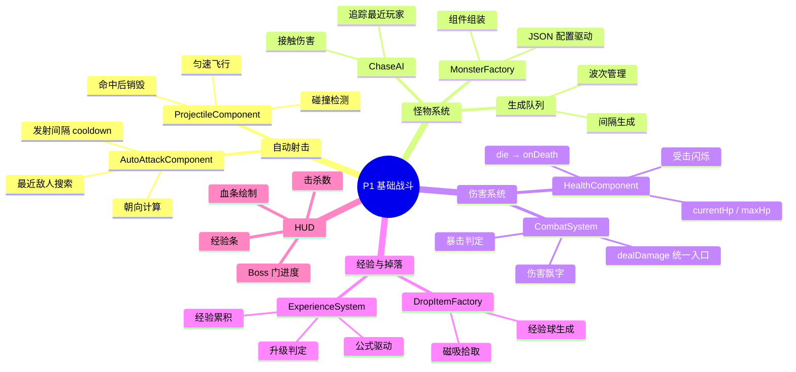
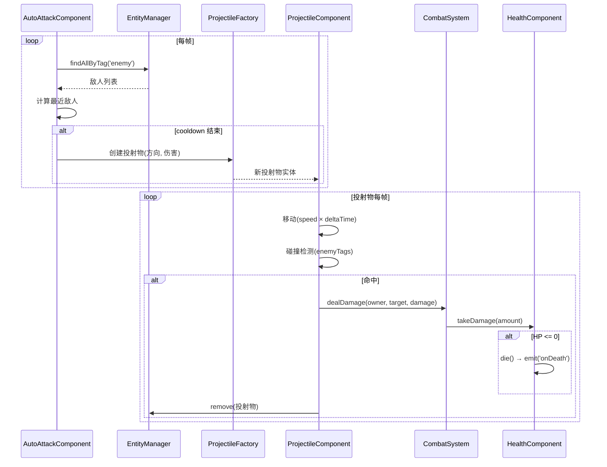
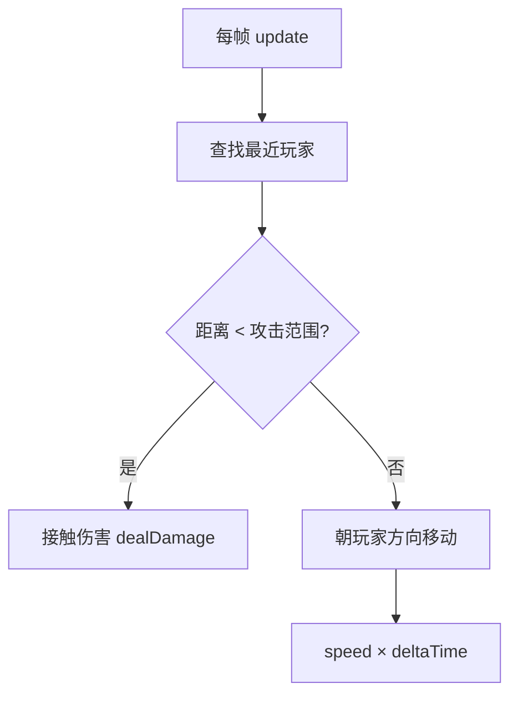
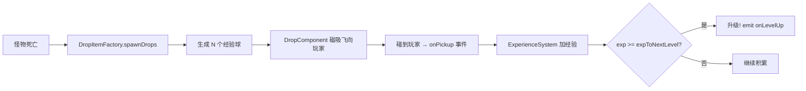

# P1 — 基础战斗系统设计

> 实现自动射击、怪物 AI、伤害结算、经验掉落，构成游戏核心循环。

---

## 🧠 设计思维导图



---

## 🔫 自动射击流程



---

## 🧟 怪物 AI：ChaseAI



### 数据驱动配置

```json
{
  "slime": {
    "name": "史莱姆",
    "stats": { "maxHp": 30, "attack": 5, "moveSpeed": 60 },
    "expValue": 10
  }
}
```

**Unity 对应**：`ScriptableObject` 怪物模板

---

## 💎 掉落与经验



### 升级公式

```
expToNextLevel = baseExp × multiplier^(level - 1)
                = 50 × 1.3^(level - 1)

Lv.1: 50   Lv.2: 65   Lv.3: 85   Lv.5: 143
```

---

## ⚡ 设计技巧

| 技巧 | 说明 |
|------|------|
| **统一伤害入口** | 所有伤害都走 `CombatSystem.dealDamage()`，方便加护甲/暴击/减伤 |
| **工厂模式** | `MonsterFactory.create(type)` 从 JSON 读配置自动组装组件 |
| **磁吸拾取** | 经验球不需要精确走到，进入范围自动飞向玩家，手感好 |
| **公式外置** | 升级经验、伤害系数全在 `formulas.json`，改数值不改代码 |
