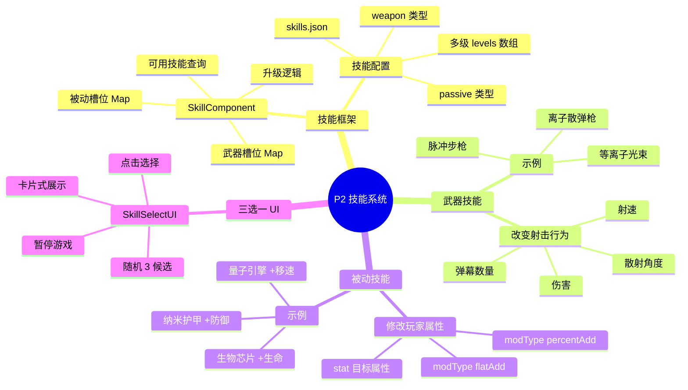
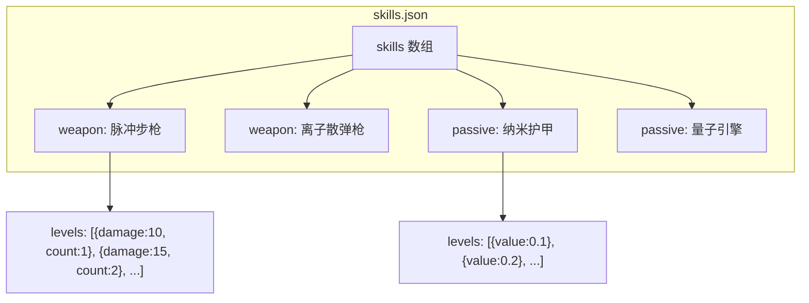
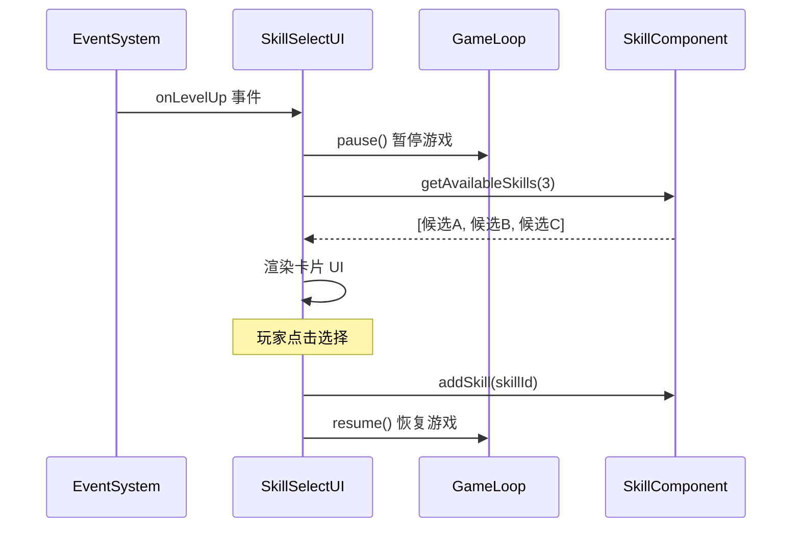

# P2 — 技能系统设计

> 武器 + 被动双类型技能框架，三选一升级 UI，全数据驱动。

---

## 🧠 设计思维导图



---

## 🎯 技能数据结构



### 武器 vs 被动的区别

| 属性 | 武器(weapon) | 被动(passive) |
|------|-------------|--------------|
| 影响 | AutoAttackComponent 的射击参数 | 玩家 Entity 的属性值 |
| 配置 | damage, fireRate, count, spread | stat, modType, value |
| 视觉 | 改变弹幕外观/数量 | 无直接视觉变化 |
| 升级 | 每级改变多个射击参数 | 每级增加 buff 数值 |

---

## 🃏 三选一流程



### 候选技能筛选策略

```javascript
getAvailableSkills(count) {
    // 1. 已有技能未满级 → 可升级
    // 2. 未获得的技能 → 可新增
    // 3. 随机打乱后取前 count 个
    // 4. 标记 isUpgrade / currentLevel
}
```

---

## ⚡ 设计技巧

| 技巧 | 说明 | Unity 对应 |
|------|------|-----------|
| **策略模式** | 武器/被动用同一 SkillComponent 管理，type 区分行为 | `ScriptableObject` 多态 |
| **配置继承** | levels 数组表达多级属性，代码只读当前级 | `AnimationCurve` |
| **modType** | `percentAdd` 百分比加 / `flatAdd` 固定加 | `StatModifier` 模式 |
| **随机不重复** | Fisher-Yates 洗牌保证候选不重复 | `List.Shuffle()` |
