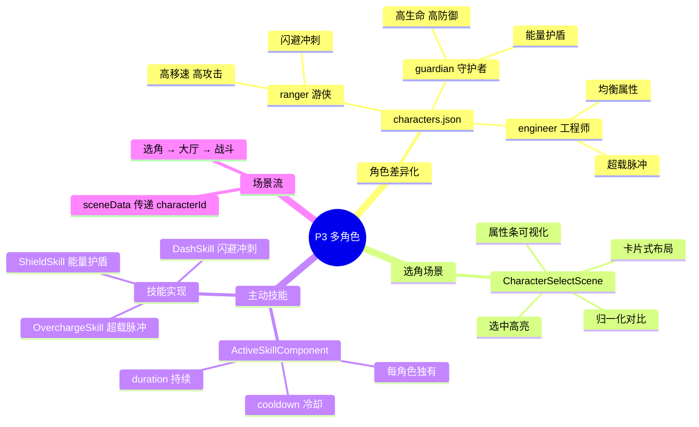
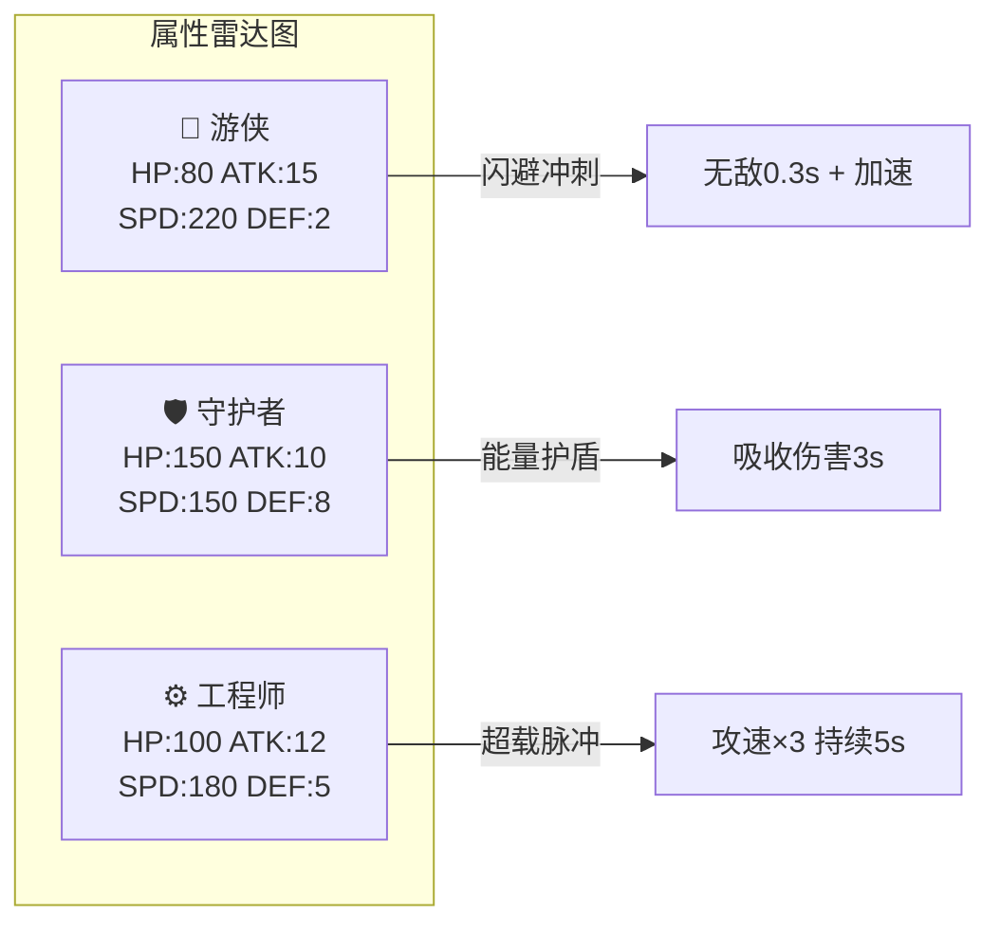
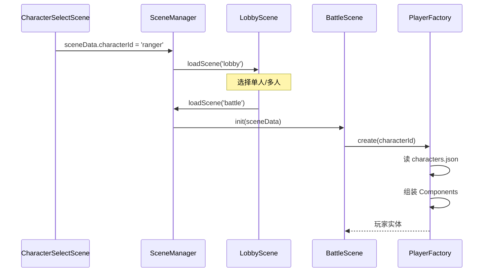

# P3 — 多角色系统设计

> 3 个差异化角色 + 主动技能 + 选角场景，ScriptableObject 模式驱动。

---

## 🧠 设计思维导图

---

## 🎭 角色对比

---

## 🎮 选角 → 战斗的数据流

---

## ⚡ 设计技巧

| 技巧 | 说明 | Unity 对应 |
|------|------|-----------|
| **ScriptableObject 模式** | `characters.json` 定义所有角色属性 | `CharacterSO.asset` |
| **属性归一化** | 属性条用 `value/maxValue` 做百分比条 | UI Slider |
| **主动技能多态** | 每个技能是独立类，共享 `ActiveSkillComponent` 接口 | 抽象类 + override |
| **场景传参** | `sceneData` 跨场景传递选角结果 | `DontDestroyOnLoad` 或 static |
