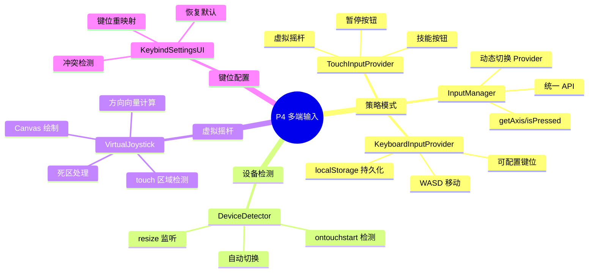
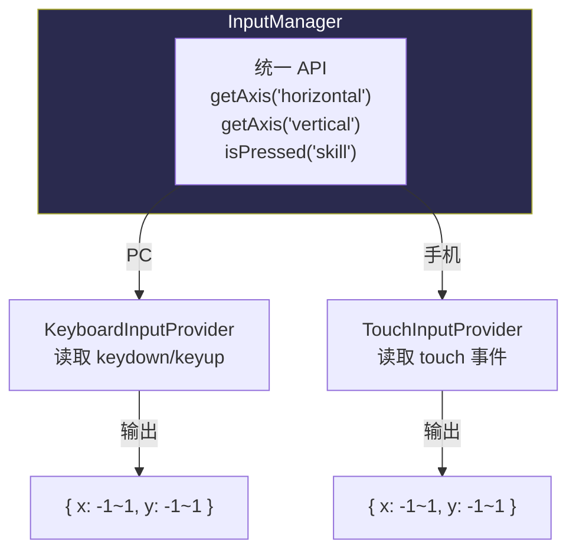
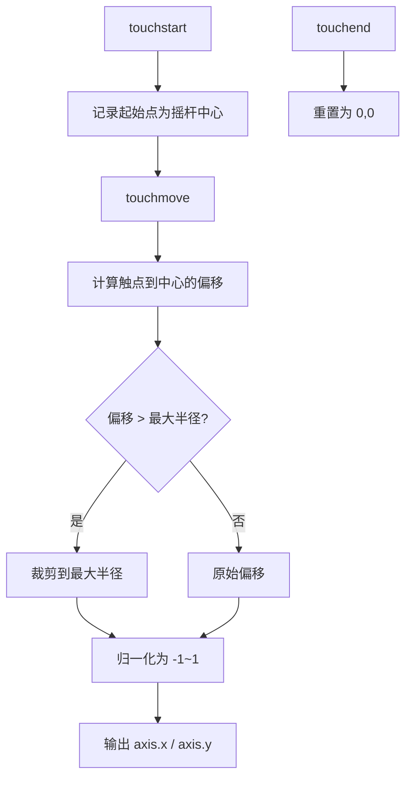

# P4 — 多端输入系统设计

> 策略模式实现 PC 键盘 + 手机触屏的统一输入抽象。

---

## 🧠 设计思维导图



---

## 🎯 核心架构：策略模式



### 为什么用策略模式？

```javascript
// ❌ 条件分支（难维护，加新设备要改所有地方）
if (isMobile) {
    dx = touchJoystick.x;
} else {
    dx = keyboard.isDown('D') ? 1 : keyboard.isDown('A') ? -1 : 0;
}

// ✅ 策略模式（加新设备只需新增 Provider）
dx = inputManager.getAxis('horizontal'); // 自动走当前 Provider
```

**Unity 对应**：`Input System` 的 `InputAction` + `Control Scheme`

---

## 📱 虚拟摇杆实现



---

## ⚡ 设计技巧

| 技巧 | 说明 | Unity 对应 |
|------|------|-----------|
| **Provider 抽象** | 输入设备只需实现 `getAxis/isPressed` 接口 | `InputDevice` |
| **运行时切换** | `switchProvider()` 不重启游戏 | `Control Scheme` 切换 |
| **触屏防穿透** | `touch-action: none` CSS + `preventDefault()` | `EventSystem.IsPointerOverGameObject` |
| **键位持久化** | `localStorage` 存储自定义键位 | `PlayerPrefs` |
| **addClickOrTouch** | 统一 click + touchend，防 300ms 延迟 | `EventTrigger` |
