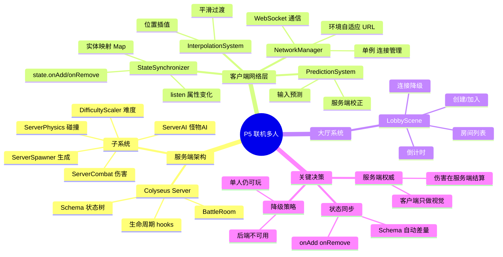
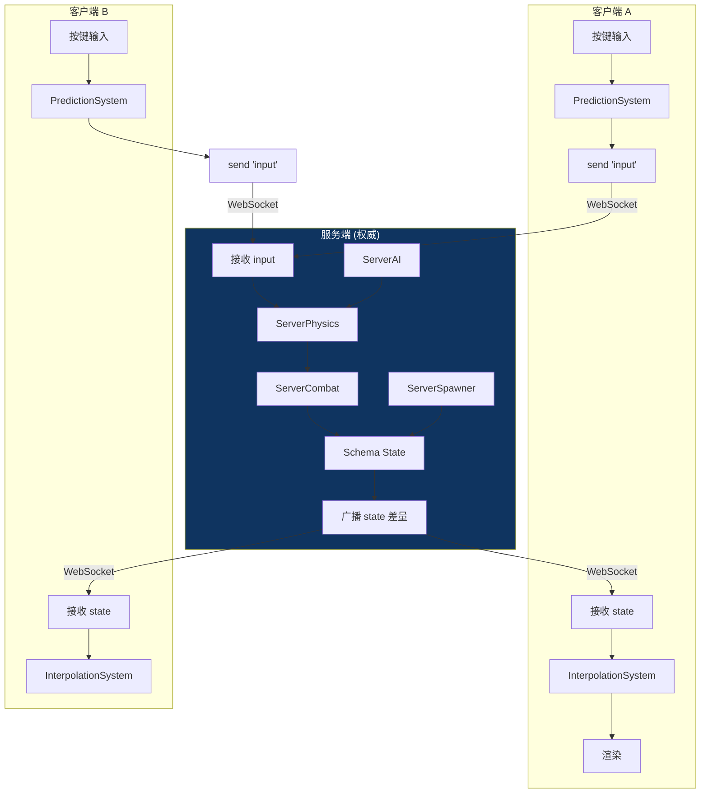
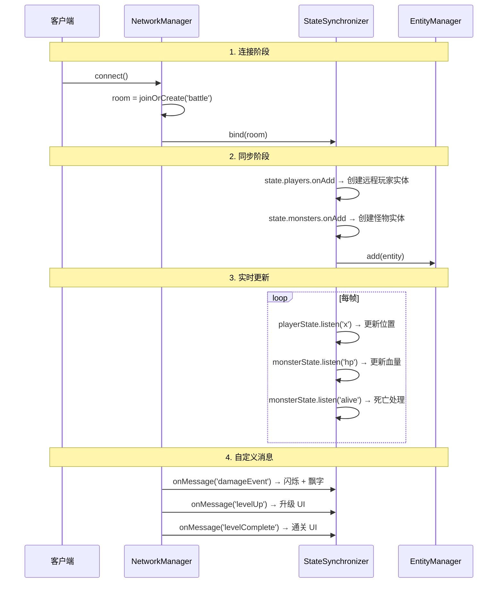
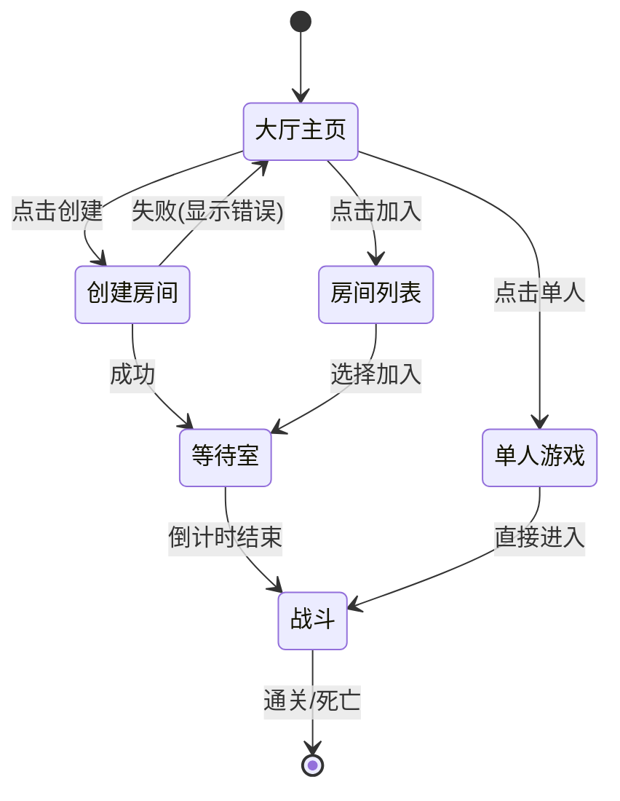

# P5 — 联机多人系统设计

> Colyseus 服务端权威架构，状态同步，大厅/房间，难度缩放。这是最复杂的一个阶段。

---

## 🧠 设计思维导图



---

## 🏛️ 服务端权威架构



### 为什么选择服务端权威？

| 方案 | 优点 | 缺点 |
|------|------|------|
| **P2P** | 无需服务器 | 作弊容易、同步复杂 |
| **客户端权威** | 响应快 | 不安全 |
| **服务端权威** ✅ | 防作弊、一致性 | 延迟需要预测补偿 |

---

## 📡 状态同步流程



---

## 🎮 大厅流程



---

## 📊 难度缩放

```
multiplier = 1.0 + (playerCount - 1) × 0.5

1人: ×1.0    2人: ×1.5    3人: ×2.0    4人: ×2.5
```

缩放影响：怪物 HP、怪物数量、Boss HP（不影响伤害）

---

## ⚠️ 关键踩坑

| 问题 | 根因 | 修复 |
|------|------|------|
| 客户端杀了 Boss 服务端不知道 | `ProjectileComponent` 在本地造成伤害 | 联网模式 `_checkHit` 不造成伤害 |
| 怪物血条不变 | `healthComp.hp` 应为 `healthComp.currentHp` | 修正属性名 |
| 升级飞快 | 双重经验（`_awardExp` + 经验球拾取） | 移除 `_awardExp`，只保留经验球 |
| 升级公式不对 | 服务端读错了配置字段名 | `baseExp→baseExpToLevel` |
| 旧服务器没关 | 新编译代码启动失败，端口被占用 | 先 kill 旧进程 |
| 双份实体 | EventSystem 监听器泄漏（匿名函数 off 失败） | 预绑定引用 + destroy 清理 |

---

## ⚡ 设计技巧

| 技巧 | 说明 | Unity 对应 |
|------|------|-----------|
| **服务端权威** | 所有伤害/击杀/经验在服务端计算 | `Mirror` ServerRpc |
| **Schema 差量同步** | Colyseus 自动只发送变化的字段 | `NetworkVariable` |
| **客户端预测** | 输入立即本地执行，服务端校正 | `ClientNetworkTransform` |
| **延迟生成** | Boss 房间怪物等门开了才生成 | `ObjectPool` + 条件激活 |
| **消息回调清理** | `unbind()` 时 `offMessage` 所有注册的回调 | `OnDestroy` 取消订阅 |
