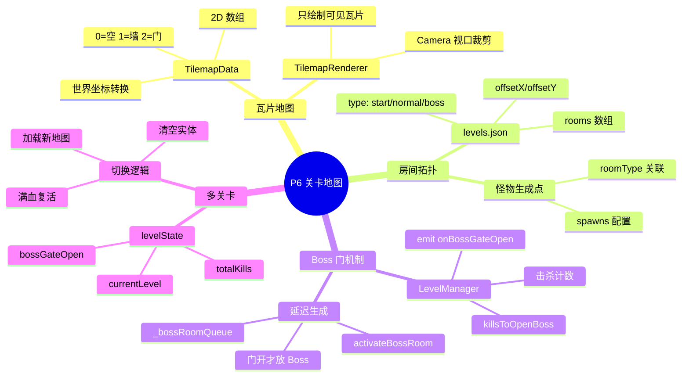
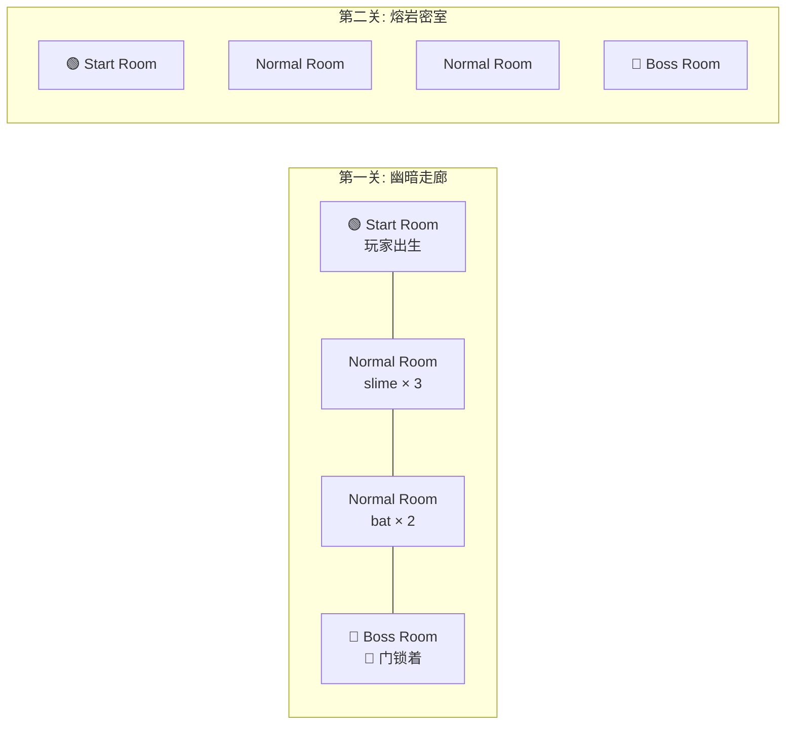
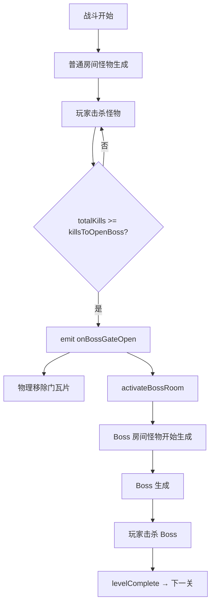

# P6 — 关卡地图系统设计

> 房间拓扑式瓦片地图、Boss 门机制、多关卡切换。

---

## 🧠 设计思维导图



---

## 🗺️ 房间拓扑结构



---

## 🚪 Boss 门流程



### 延迟生成的必要性

```
❌ 不延迟：关卡加载时同时生成 Boss
   → Boss 被困在锁着的门后面
   → 但 AI 会尝试追玩家导致卡墙

✅ 延迟生成：门开了才把 Boss 加入生成队列
   → Boss 在玩家能到达时才出现
   → 战斗体验更自然
```

---

## ⚡ 设计技巧

| 技巧 | 说明 | Unity 对应 |
|------|------|-----------|
| **瓦片碰撞** | `isWalkable(x,y)` 查询瓦片类型 | `Tilemap.GetTile` |
| **视口裁剪** | 只渲染相机范围内的瓦片 | `Tilemap` 自带 |
| **延迟生成** | `_bossRoomQueue` 门开才释放 | `ObjectPool.Get()` |
| **防推墙** | `_canPushTo` 碰撞推开前检查墙壁 | `Physics2D.OverlapBox` |
