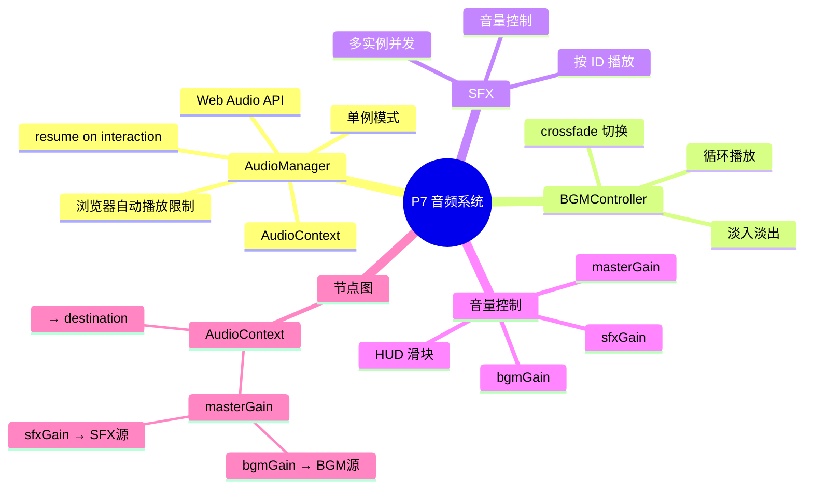
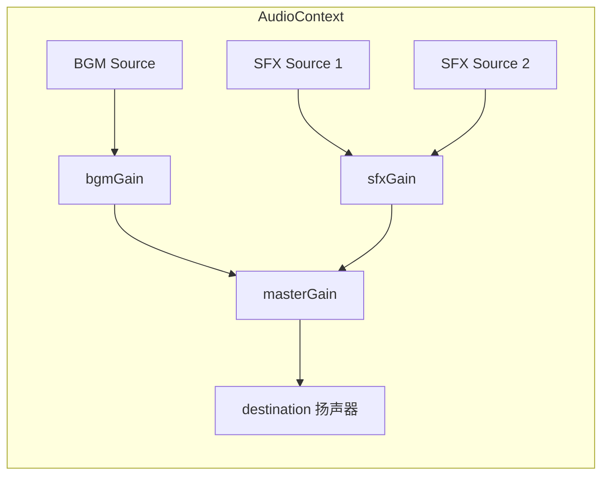
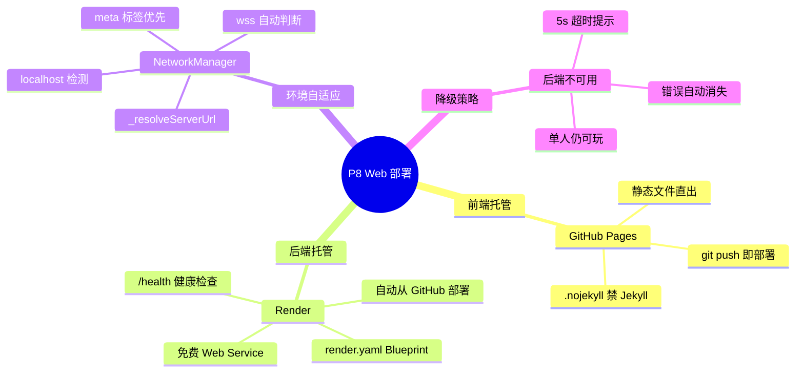
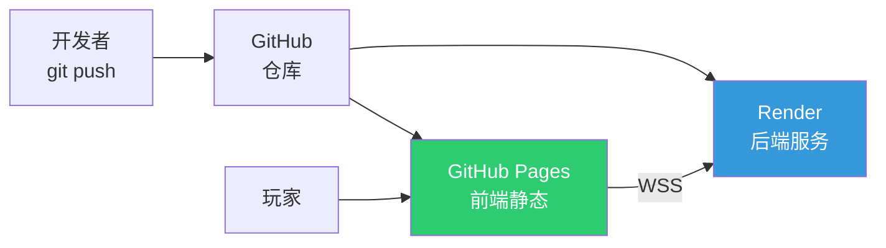

# P7 — 音频系统设计

> Web Audio API 驱动的 BGM + SFX 音频管理。

---

## 🧠 设计思维导图

---

## 🔊 Web Audio API 节点图

---

## ⚡ 设计技巧

| 技巧 | 说明 | Unity 对应 |
|------|------|-----------|
| **单例** | 全局一个 AudioManager | `AudioManager.instance` |
| **淡入淡出** | `linearRampToValueAtTime` | `AudioSource.DOFade` |
| **自动播放限制** | 首次用户交互后 `resume()` | 不需要（Unity 无此限制） |
| **音量节点图** | GainNode 层级控制 | `AudioMixer` |

---

# P8 — Web 部署设计

> GitHub Pages 前端 + Render 后端，环境自适应，优雅降级。

---

## 🧠 设计思维导图

---

## 🌐 部署架构

---

## ⚡ 设计技巧

| 技巧 | 说明 |
|------|------|
| **.nojekyll** | 禁止 GitHub 用 Jekyll 构建，保留原始 JS 文件 |
| **meta 标签配置** | `<meta name="game-server" content="wss://...">` 不改代码换服务器 |
| **CORS** | 服务端允许 `*.github.io` 跨域 |
| **环境检测** | `localhost` → `ws://`，其他 → `wss://` |
| **超时保护** | 5 秒连接超时，不让玩家无限等待 |
