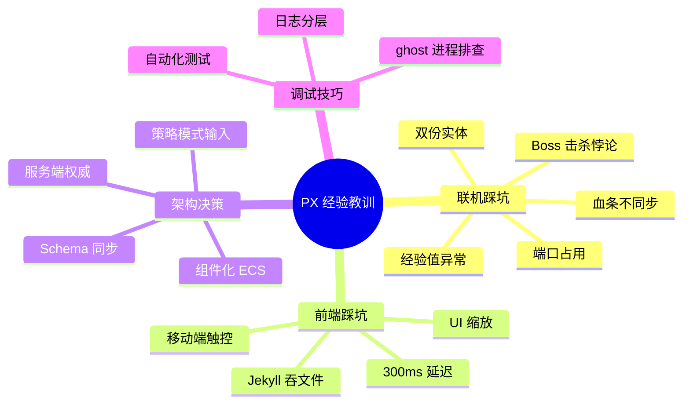
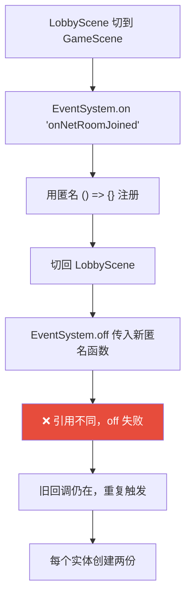
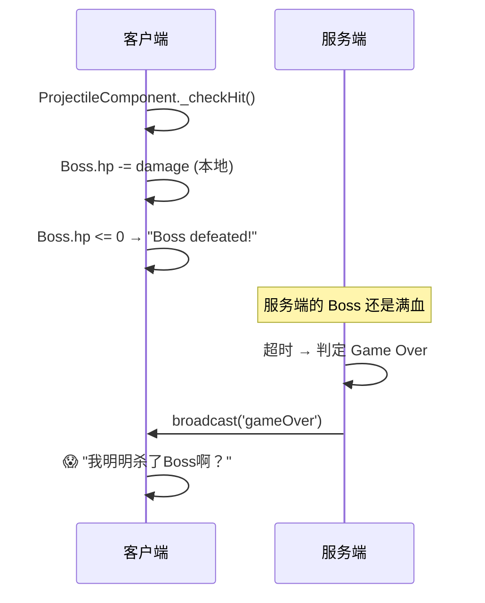
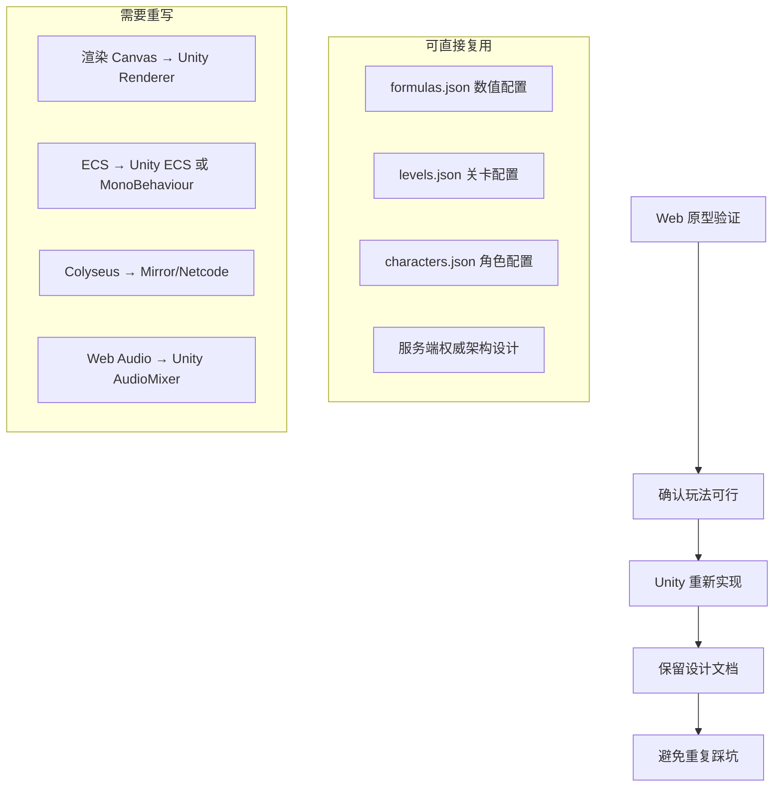

# PX — 经验教训与踩坑总结

> 整个项目开发过程中遇到的所有重大问题、根因分析和修复方案的完整记录。

---

## 🧠 概览



---

## 🔥 Bug 全记录

### 1. 双份实体（最难排查）



**修复**：预绑定引用

```javascript
// ❌ 错误
EventSystem.on('onNetRoomJoined', () => this.handleJoin());
EventSystem.off('onNetRoomJoined', () => this.handleJoin()); // 不同引用！

// ✅ 正确
this._boundHandleJoin = this.handleJoin.bind(this);
EventSystem.on('onNetRoomJoined', this._boundHandleJoin);
EventSystem.off('onNetRoomJoined', this._boundHandleJoin); // 同一引用
```

**教训**：事件系统中永远不要用匿名函数，必须保存引用。

---

### 2. Boss 击杀悖论

```
客户端: Boss HP → 0 → "Boss defeated!" → 通关！
服务端: Boss HP = 满血 → 没死 → 不发 levelComplete → Game Over
```



**修复**：联网模式禁用本地伤害

```javascript
_checkHit(target) {
    if (NetworkManager.instance?.isConnected) {
        return; // 联网时不在本地造成伤害
    }
    // 单人模式正常处理
}
```

**教训**：服务端权威 = 客户端绝不能修改权威数据。

---

### 3. 经验值飞速升级

| 症状 | 根因 |
|------|------|
| 打一个怪升一级 | `baseExp` 读成了 30，实际应为 `baseExpToLevel` = 100 |
| 经验翻倍 | `_awardExp()` 直接加 + 经验球再加 = 双重经验 |

**修复**：
- 服务端读 `formulas.json` 的 `baseExpToLevel` 字段
- 移除 `_awardExp()`，只保留经验球拾取

---

### 4. GitHub Pages 404

```
部署后所有 .js 文件返回 404
```

**根因**：GitHub 默认启用 Jekyll，会忽略以 `_` 开头的文件/目录

**修复**：在仓库根目录添加 `.nojekyll` 空文件

---

### 5. 移动端按钮无响应

```
PC 上正常，手机上点按钮没反应
```

**根因**：
1. `click` 事件在移动端有 300ms 延迟
2. 部分按钮被 Canvas 遮挡

**修复**：
- 创建 `addClickOrTouch.js` 工具函数
- 同时监听 `click` 和 `touchend`
- `touchend` 中 `e.preventDefault()` 防止触发 click

---

### 6. Ghost 服务器进程（端口 2567）

```
Error: listen EADDRINUSE: address already in use :::2567
```

**排查**：
```bash
netstat -ano | findstr :2567
taskkill /PID <pid> /F
```

**预防**：创建 `start-server.bat` 启动前自动杀旧进程

---

### 7. 怪物血条不动

```
打了有受击动画，但血条没变化
```

**根因**：`StateSynchronizer` 监听的是 `hp`，但 `HealthComponent` 的属性名是 `currentHp`

**修复**：统一属性名映射

---

## 📋 经验法则

| 编号 | 法则 | 来源 |
|------|------|------|
| 1 | 事件回调必须保存引用，不用匿名函数 | Bug #1 |
| 2 | 联网模式客户端不修改权威数据 | Bug #2 |
| 3 | 配置字段名必须精确匹配 | Bug #3 |
| 4 | 静态部署平台检查构建工具兼容性 | Bug #4 |
| 5 | 移动端必须同时处理 touch 和 click | Bug #5 |
| 6 | 启动服务前先检查端口占用 | Bug #6 |
| 7 | 状态同步中属性名必须两端一致 | Bug #7 |
| 8 | 自动化测试能早发现 90% 的回归 | 全部 |
| 9 | 先查日志，再猜测原因 | 全部 |
| 10 | 每次修复后立即跑测试验证 | 全部 |

---

## 🎯 给 Unity 移植的建议


